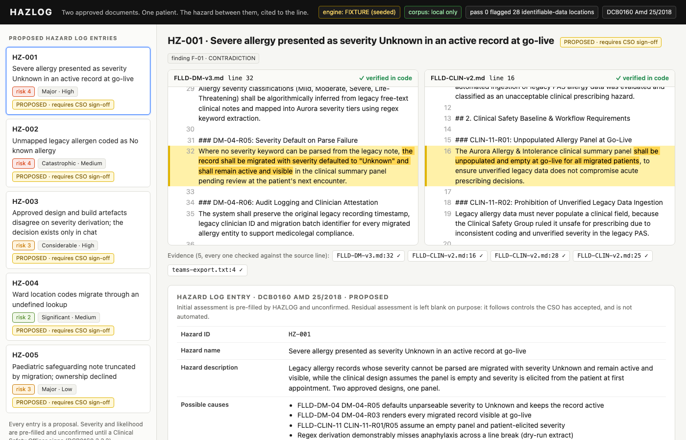

# HAZLOG

**Two approved documents. Both correct. Together, a hazard nobody logged.**

`make demo` · no network, no model, no key · [what you'll see](#what-youll-see) · [limits](#limits)

[](./docs/hazlog-hz001.png)

---

## The room

A hospital is migrating 1.4 million allergy records to a new electronic patient record.

The data migration design, approved 14 January, says that when the migration cannot parse a severity from a legacy note, the record goes live anyway with severity set to **"Unknown"**, active and visible in the clinical panel.

The clinical design, approved 19 February and reviewed by the consultant anaesthetist who is also the trust's Clinical Safety Officer, says the allergy panel is **empty** at go-live and clinicians capture allergies from the patient at the **first appointment after cutover**.

Each document is correct on its own.

## The consequence

Together they mean a patient with a documented anaphylaxis can present after go-live with the allergy recorded as severity Unknown. The prescribing hard-stop that forces reconciliation exempts emergency orders. The remedy the clinical design relies on, capture at first appointment, is the appointment the patient is already in.

## Why nobody caught it

Data migration owns one document. Clinical design owns the other. The decision that would have reconciled them was taken in a Teams channel on 3 March, and it reached neither: the walkthrough that would have minuted it was cancelled, the change request was deferred, and the approved design still says what it said in January.

No role in the programme reads all four artefacts as one corpus.

## The obligation

DCB0160 (Amd 25/2018, v3.2), mandated under section 250 of the Health and Social Care Act 2012, requires the deploying organisation to:

- identify and document known and foreseeable hazards to patients, in normal and fault conditions (4.3.1)
- estimate severity, likelihood and clinical risk for each one (4.4.1), recorded in the Hazard Log (guidance 4.4.2)
- keep a Hazard Log, each version approved by a Clinical Safety Officer who is a suitably qualified clinician (3.3.1, 3.3.2, 2.3.1)
- record every decision that influences clinical risk in the Clinical Risk Management File (3.1.4)

The hazard above is not in the hazard log. The standard obliges you to log the hazards you have identified. It does not help you find the ones that live in the space between two separately approved documents.

## The trap

So put a language model on the corpus. Except the corpus is:

- patient-identifiable clinical detail (an NHS number, a name, a date of birth and an anaphylaxis history, pasted into chat as a worked example)
- supplier contract values (a decommission fee per quarter of delay)
- named clinicians discussing a child's safeguarding flag

Uploading that to a public model to look for compliance problems is the compliance problem.

## The incumbents

These artefacts live in tools today. None of those tools reads across them, and all of them are cloud.

| Tool | Holds | Reads across artefacts? | Where it runs |
|---|---|---|---|
| Jira | Tickets, decisions | No | Cloud |
| DOORS | Formal requirements | Within a module only | Cloud / on-prem, licensed |
| Confluence | Design docs | No | Cloud |
| SharePoint | Everything, unstructured | No | Cloud |

## The build

A local Gemma model reads all four artefacts as one corpus and returns candidate hazards. Every hazard cites file and line in at least two documents, and every citation is checked in code against the source text before it is shown. A hazard whose quote is not on the line it claims is discarded, not surfaced. Gemini goes online only for isolated terms: a SNOMED code, a standard reference. It never sees a document line.

```
corpus/                       local, never leaves the machine
  FLLD-DM-v3.md               data migration design
  FLLD-CLIN-v2.md             clinical design
  field-mapping.csv           legacy -> target field map
  teams-export.txt            decision channel export
        |
  Pass 0  deterministic pre-pass          no model
        |   requirement IDs, approvals, dates, roles, fields, CSV rows,
        |   chat messages, SNOMED codes, identifiable-data locations
        |   -> out/index.json
  Pass 1  extraction                      Gemma, local, schema-constrained
  Pass 2  hazard detection                Gemma, local, schema-constrained
        |   each candidate cites >= 2 sources in >= 2 files, FILE:LINE
  Pass 3  hazard log entry                Gemma, local, schema-constrained
        |   causes, clinical effect, proposed severity and likelihood,
        |   controls, owner, evidence
        v
  out/findings.json  out/hazard-log.json
        |
  UI: two source panes side by side, the entry beneath, CSO sign-off state

  Gemini (online, optional, one function): a term in, a lookup out.
```

**Invariant:** the corpus never leaves the machine. Gemini receives only isolated terms, never document content. This is enforced in code, not prose: the local client refuses any host that is not loopback, the Gemini client has no import that can read a file and takes a single short string, and `test/boundary.test.ts` asserts all three.

## Why these two models

Local is required, not preferred. See [the trap](#the-trap). Cross-document reading is the work that touches every identifiable line, so it runs on Gemma through Ollama on the machine that already holds the corpus.

Gemini handles what a local model cannot: the current text and version of a standard, and live terminology lookup. Those are single terms, so they can go online.

## What you'll see

`make demo` opens a page that reads the committed `out/*.json`. Select a hazard. The two source documents render side by side with the contradicting lines highlighted, each labelled with its file, its line, and whether the quoted excerpt was found on that line. The DCB0160 hazard log entry is beneath: causes, clinical effect, proposed severity and likelihood with the standard's definitions, the computed initial risk rating, proposed controls, proposed owner, evidence, and the state **PROPOSED · requires CSO sign-off**.

The sign-off panel is pre-filled with the proposal. A named Clinical Safety Officer can confirm it, amend severity or likelihood before signing, or reject it with a reason. Only signed entries export. Residual risk is deliberately not automated.

Five entries ship in the fixture, from the same corpus:

| | Hazard | Proposed |
|---|---|---|
| HZ-001 | Severe allergy presented as severity Unknown in an active record at go-live | Major · High · risk 4 |
| HZ-002 | Unmapped legacy allergen coded as *No known allergy* (SNOMED 716186003) | Catastrophic · Medium · risk 4 |
| HZ-003 | Approved design and build artefacts disagree on severity derivation; the decision exists only in chat | Considerable · High · risk 3 |
| HZ-004 | Ward location codes migrate through an undefined lookup | Significant · Medium · risk 2 |
| HZ-005 | Paediatric safeguarding note truncated by migration; ownership declined | Major · Low · risk 3 |

## Run it

Node 24 or later. Nothing to install: the TypeScript runs directly.

```bash
make demo        # UI from the committed fixtures. No network, no Ollama, no key.
make test        # verifier, fixtures, boundary, pre-pass
make prepass     # Pass 0 only, deterministic: out/index.json
make run         # Pass 0 + three local Gemma passes via Ollama -> out/*.json
make lookup TERM=716186003   # the narrow online path (needs GEMINI_API_KEY)
```

For `make run`: install [Ollama](https://ollama.com), then `ollama pull gemma3`. Override the tag with `HAZLOG_MODEL=gemma3:12b` if you have pulled a larger one.

## Limits

- **The corpus is synthetic.** Four artefacts, written for this demo to contain five defects. It is shaped like a real programme's artefacts; it is not one.
- **Severity and likelihood are proposals.** The rating is computed from the matrix, never asserted by the model, and none of it is a hazard log entry until a named CSO signs. The UI records the signature in the browser only.
- **The fixture is the demo.** `out/hazard-log.json` and `out/findings.json` are committed, and `make test` holds them to the same rule as a live run: every excerpt must resolve to its line, every finding must span two files. The local Gemma path is wired, schema-constrained and exercised end to end against a fake Ollama on loopback that returns canned output containing a fabricated citation, a single-file finding and an off-scale severity; `test/pipeline.test.ts` asserts all three are dropped with a reason and the real one survives. It has not been run against a live model on the machine this was built on, because Ollama was not installed there. Run `make run` and the engine badge changes from FIXTURE to GEMMA_LOCAL.
- **Four artefacts.** Cross-document detection at this corpus size fits in one context window. Beyond that it needs chunking and a second pass over pairs, and that is not built.
- **The risk matrix** in `shared/risk-matrix.json` is Tables 7 to 10 of the DCB0160 Implementation Guidance v4.2 (02.05.2018), checked cell for cell against the official PDF on 3 September 2026 and pinned by a test. The guidance calls those tables *examples*: an organisation's own Clinical Risk Management Plan (3.2.1) defines the criteria it actually uses, so a trust would swap in its own. Clause numbers are from the Requirements Specification v3.2.
- **The Gemini lookup** is one function and has not been exercised against a live key here. It is tested with a fake fetch that captures the request and checks no corpus line is in it.
- **Not wired:** live ingestion from Confluence, Jira or Teams; diagrams; residual-risk assessment; a persistent hazard log beyond the browser.

## Layout

```
corpus/           the four synthetic artefacts
shared/           schema.json (constrained decoding), risk-matrix.json
src/              corpus.ts (loader + verifier) · prepass.ts · passes.ts · ollama.ts · gemini.ts · risk.ts · run.ts
out/              index.json (generated) · findings.json · hazard-log.json (committed fixtures)
ui/index.html     the page
server.mjs        `make demo`
test/             verifier · fixtures · boundary · prepass
```

## License

MIT.
